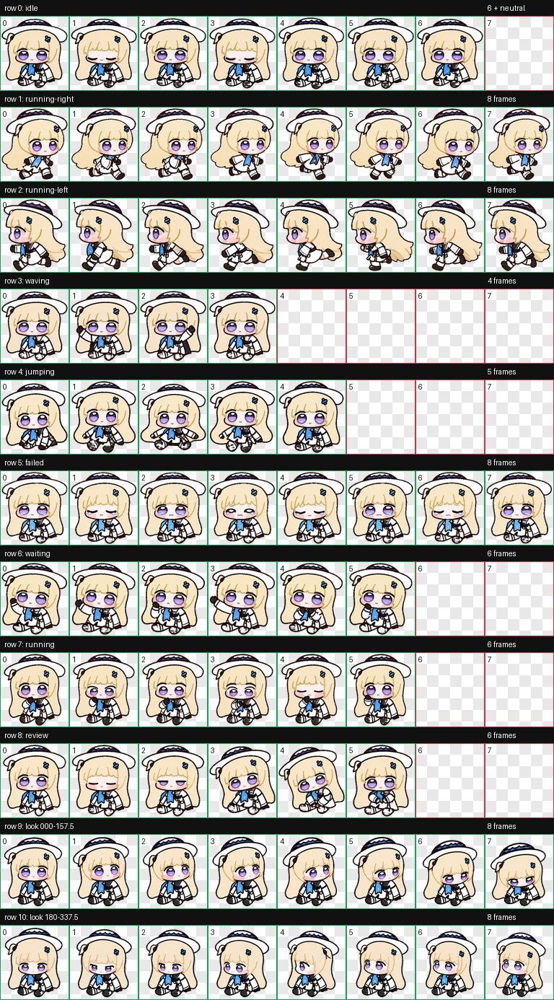

# 菲比啾比 · Codex 桌面宠物

一个非官方、粉丝向的 Codex v2 桌面宠物。形象以《鸣潮》菲比的 Q 版贴纸风格为灵感制作，包含待机、移动、挥手、跳跃、等待、工作、完成、失败和 16 向视线跟随动画。



## 安装

### 一键安装（Windows）

在 PowerShell 中运行：

```powershell
$p="$env:TEMP\install-codex-phoebe-pet.ps1"; irm https://raw.githubusercontent.com/RuichiXu/codex-phoebe-pet/main/install.ps1 -OutFile $p; & $p
```

安装完成后重启 Codex。脚本会把宠物安装到：

```text
%USERPROFILE%\.codex\pets\phoebe-chibi
```

重复运行同一命令即可更新。

### 从仓库安装

```powershell
git clone https://github.com/RuichiXu/codex-phoebe-pet.git
cd codex-phoebe-pet
.\install.ps1
```

### 卸载

在已克隆的仓库中运行：

```powershell
.\uninstall.ps1
```

也可以手动删除 `%USERPROFILE%\.codex\pets\phoebe-chibi`。

## 动画规格

- Codex 宠物精灵图版本：v2
- 图集：8 列 × 11 行，1536 × 2288，RGBA WebP
- 标准状态：待机、向右移动、向左移动、挥手、跳跃、失败、等待、工作、完成
- 视线状态：16 个方向，每 22.5° 一帧

## 文件

```text
pet/phoebe-chibi/
├── pet.json
└── spritesheet.webp
```

## 声明

这是非官方粉丝作品，与库洛游戏无隶属或授权关系。《鸣潮》、菲比及相关名称、设定和原作知识产权归其权利人所有。本仓库仅用于个人、非商业的 Codex 桌面宠物体验；角色美术素材不随安装脚本代码一并授权。详见 [NOTICE.md](NOTICE.md)。

安装脚本代码采用 MIT 许可，角色美术除外。详见 [LICENSE-CODE](LICENSE-CODE)。

English instructions: [README_EN.md](README_EN.md)
